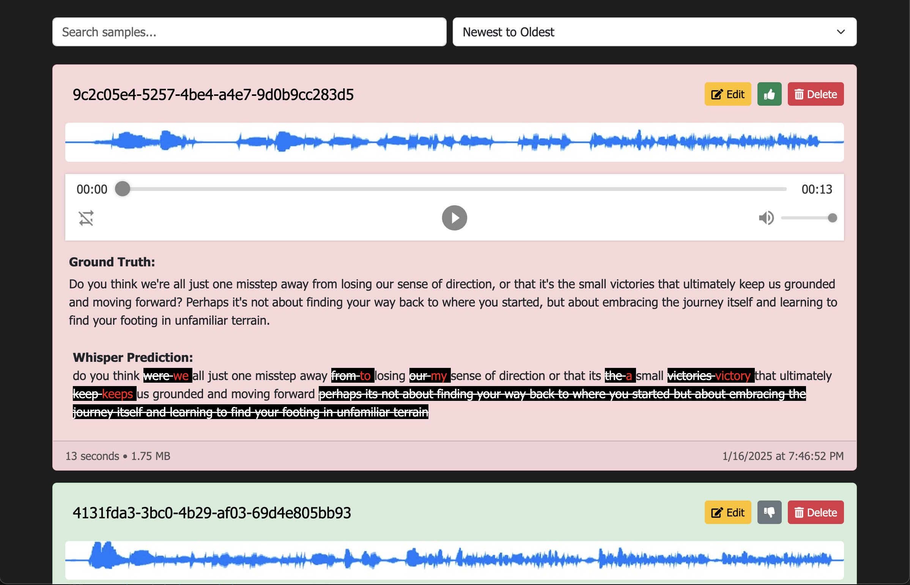
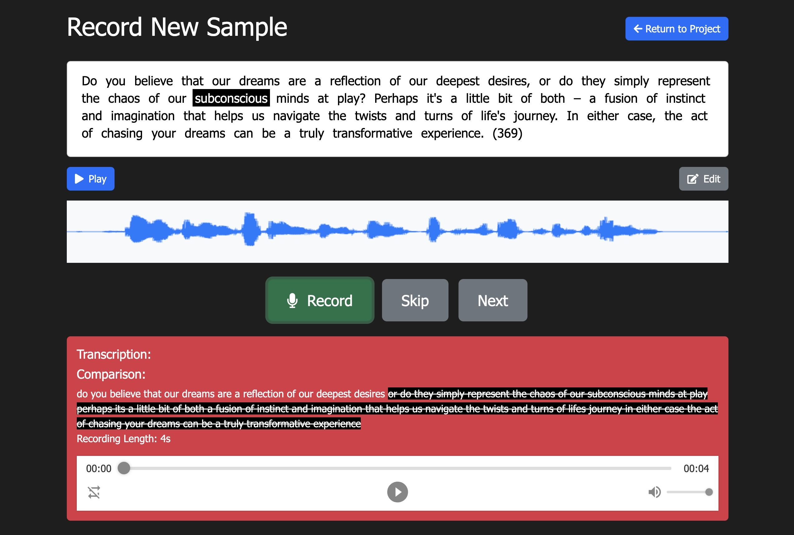

# Phonotate.App

Phonotate.App is a local, open-source **Electron app** built with **React** designed to simplify creating training data for **StyleTTS 2** and voice cloning models. Phonotate provides a seamless workflow for recording, analyzing, and managing voice samples. Whether you use **open-source backend services** or **OpenAI APIs**, this app ensures that all your data remains secure and within your control.

---

## 🌟 Key Features

### **Completely Local**
Phonotate.App stores all your data in a local **SQLite database**. None of your information leaves your network unless you configure external services.

### **AI-Powered Prompts**
- Automatically generates **AI-driven prompts** using your choice of:
  - **OpenWeb UI** (Open-source AI text generation)
  - **OpenAI GPT models**
  
### **Seamless Whisper Integration**
- Analyze recordings using **Whisper ASR** for transcription and accuracy checking.
- Compatible with:
  - **Whisper ASR Webservice** (Open-source Whisper backend)
  - **OpenAI Whisper API**

### **Training Data Generation**
- Automatically splits samples into:
  - **85% for training** (`train_list.txt`)
  - **15% for validation** (`val_list.txt`).
- Validation data can be **phonemized** using **espeak** for compatibility with models requiring phonetic input.

### **Modern UI**
- **Project Management:**
  - Track your projects with details like sample count, total length, and training progress.
  - Tag projects with metadata like author, emotion/style, and author ID.
- **Recording Workflow:**
  - Record, review, and analyze voice samples with live waveform visualization.
  - Quickly skip, retry, or save recordings with a few clicks.
- **Detailed Sample Management:**
  - View transcriptions, ground truth comparisons, and audio waveforms.
  - Easily mark samples as good/bad with a thumbs-up/thumbs-down system.

---

## 🤩 Getting Started

Download the application

https://github.com/LoganRickert/Phonotate.App/releases

When opening the app for the first time, click on the settings gear icon in the top right and enter the appropriate URLs and tokens.

## 📷 Screenshots






## 🚀 Requirements

### **Option 1: Fully Open-Source Workflow**
- **OpenWeb UI** for AI-generated prompts ([GitHub](https://github.com/open-webui/open-webui)).
- **Whisper ASR Webservice** for transcription ([GitHub](https://github.com/ahmetoner/whisper-asr-webservice)).
- **Kokoro-FastAPI** For text to speech generation ([GitHub](https://github.com/remsky/Kokoro-FastAPI)).

### **Option 2: OpenAI Workflow**
- **OpenAI GPT API** for prompt generation.
- **OpenAI Whisper API** for transcription.
- **OpenAI TTS API** for TTS.

### **Phonemization (Optional)**
- To generate phonemized validation data, you'll need an **espeak** API backend. 
  - Use the **phonemization_docker** included in this project:
    ```bash
    docker run --restart unless-stopped -d -p 9712:8000 espeak-phonemization
    ```

---

## 📂 App Structure

### **Landing Page**
- View a list of projects with summaries:
  - **Number of good samples**
  - **Total recording length**
- Create, edit, or delete projects.

### **Project Page**
- Manage all voice samples for a project:
  - View, edit, or delete samples.
  - See audio waveforms, playback recordings, and compare transcriptions to ground truth.
- **Generate Training Data:**
  - Automatically splits samples into training and validation sets.
  - Outputs `train_list.txt` and `val_list.txt` files to the project directory.
- **Record New Samples:**
  - Record prompts generated by your selected AI service.
  - Analyze transcription accuracy and save recordings seamlessly.

### **Recording Page**
- Live waveform visualization during recording.
- Options to retry, save, or skip prompts.
- Transcription feedback to evaluate recording quality.
- Play TTS of prompt or specific word to hear how it sounds.
- Edit prompt right on page to fix issues with flow.
---

## 🔧 Future Updates

1. **S3 Storage Support:**
   - Store and retrieve files from any S3-compatible cloud storage.
2. **Audio Quality Enhancements:**
   - Normalize audio and add compression to improve recording consistency.
3. **Improved UI/UX:**
   - A more modern design for better usability.
4. **Help Page:**
   - In-app documentation and troubleshooting.
5. **Fix Electron not packing correctly**
   - Working with Electron has its problems.

---

## 🛠 How to Build

### **Development Setup**

1. **Clone the repository:**
   ```bash
   git clone https://github.com/LoganRickert/Phonotate.App
   cd phonotate.app
   ```

2. **Install dependencies:**
   ```bash
   npm install
   ```

3. **Rebuild better-sqlite3 for Electron:**
   - Electron uses a specific version of Node.js, so you need to rebuild native modules like `better-sqlite3` to match Electron’s environment.
   ```bash
   npm run rebuild
   ```

4. **Run the app in development mode:**
   ```bash
   npm start
   ```

---

### **Building for Production**

1. **Prepare the app for production:**
   - Make sure all dependencies are installed:
     ```bash
     npm install
     ```
   - Rebuild `better-sqlite3` for production:
     ```bash
     npm run rebuild
     ```

2. **Build the app:**
   - This will package the app into a standalone executable for your platform (e.g., `.exe` for Windows, `.dmg` for macOS):
     ```bash
     npm run package
     ```

3. **Locate the build files:**
   - The final build will be located in the `release-build` folder. Distribute the files from this folder as needed.

---

### **Scripts Overview**

- `npm start` – Launch the app in development mode.
- `npm run rebuild` – Rebuild `better-sqlite3` for Electron’s environment.

---

These instructions should help you get started with both development and building the final app for distribution! Let me know if you’d like any refinements.

---

## 📜 License

Phonotate.App is licensed under the **Apache License 2.0**. See the `LICENSE` file for details.

---

## 🌐 Keywords for Search Optimization

- Voice cloning app
- Electron app for AI training
- React voice cloning
- StyleTTS training
- Whisper ASR integration
- Phonemized training data
- Open-source voice training
- Local AI tools
- Voice transcription tool

---

Phonotate.App is the perfect companion for anyone looking to create high-quality training data for voice cloning models like **StyleTTS 2**. Designed with privacy and flexibility in mind, it seamlessly integrates AI and local workflows to empower your creativity!
